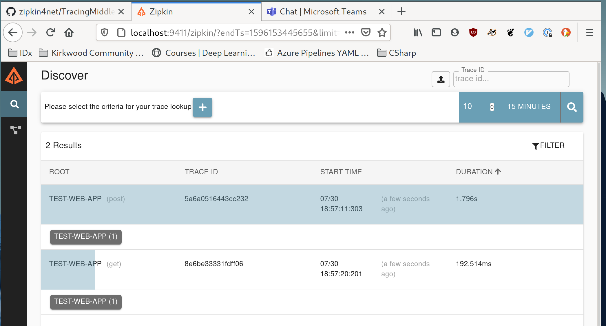

# Exploring OpenZipkin
Run zipkin server

`docker run -d -p 9411:9411 openzipkin/zipkin`

Run Web API

`dotnet run`

Make request

`GET http://localhost:5001/weatherforecast`

`POST http://localhost:5001/todo`
>application/json
{
  "name": "Walk the dog",
  "isComplete": true
}

Should see something like:

